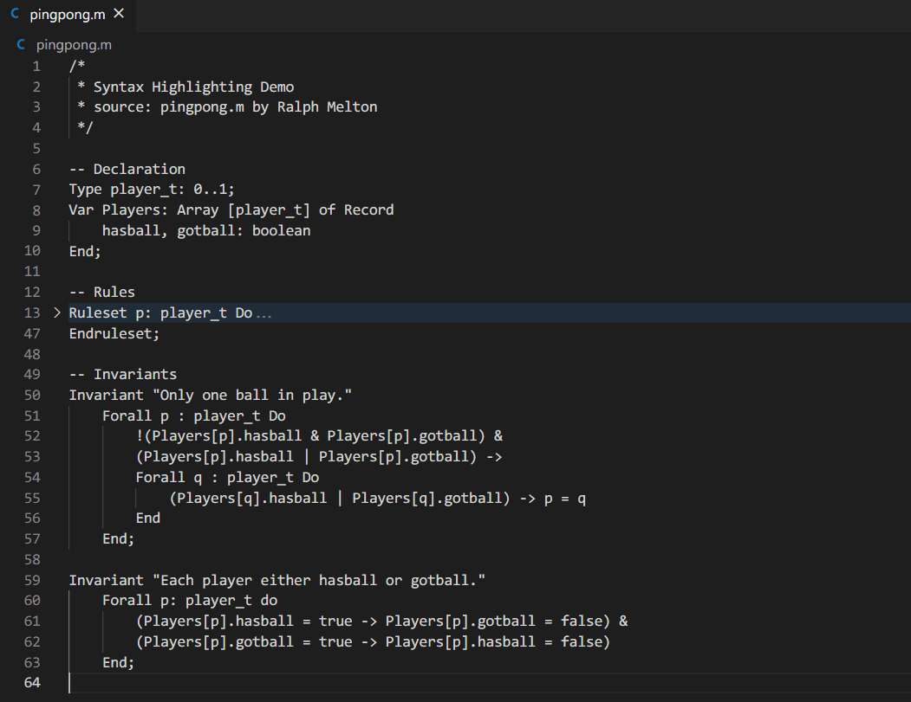

# Murphi

This is the Murphi language support for VS code. Currently, the extension only supports syntax highlighting.

## Features

### Syntax Highlighting

<!--
## Known Issues

Calling out known issues can help limit users opening duplicate issues against your extension. -->

## Release Notes

### New Feature

-   Syntax highlighting for Murphi language

### 1.0.0

Initial release of Murphi.
